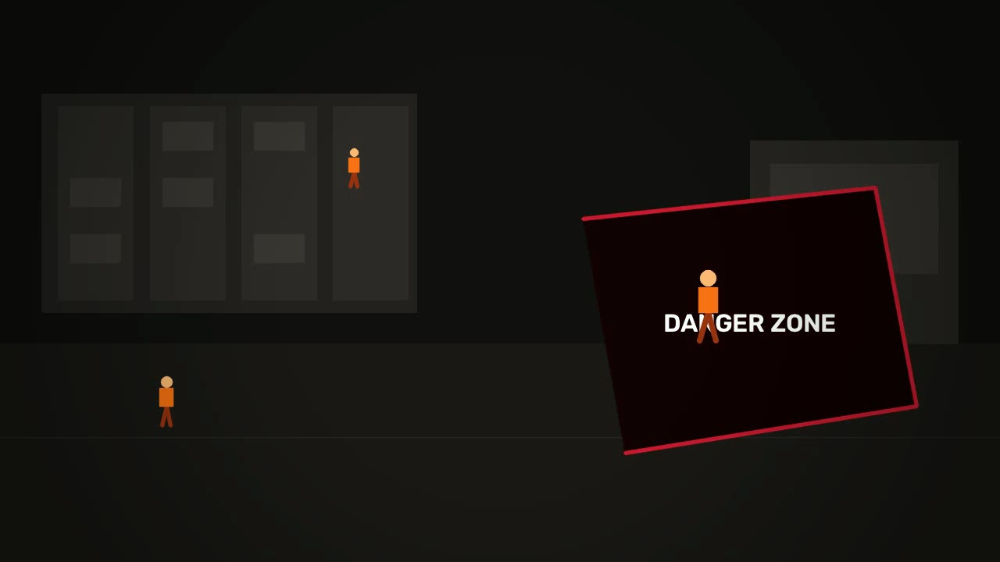

<div align="center">
  
  <h1>OpenEye</h1>
  <h3>Your Vision. Your Rules.</h3>
  <p>AI-powered camera monitoring that watches for exactly what you describe . no datasets, no training, no engineers.</p>
  
</div>

<br>

<p align="center">
  
  
  
  
</p>

---

##  The Problem

Cameras are everywhere, yet the vast majority only record. Traditional video analytics can only detect what it was trained on, and adding one new behaviour means collecting a dataset, retraining a model, and hiring an engineer. For most factories and workplaces, that cost is out of reach.

The human cost is real. The International Labour Organization estimates nearly 3 million work-related deaths every year, and Sri Lanka reports around 4,000 workplace accidents annually. Many of these incidents are preceded by warnings that a camera saw, but no one was watching.

##  What OpenEye Does

A supervisor types a rule in plain English, draws monitoring zones on the camera view, and OpenEye watches for exactly that — every second of every shift. When a rule matches, it escalates immediately with an evidence frame, a confidence score, and a plain-language explanation.

Key capabilities:

- **Zero-shot detection** — the rule is the prompt, no model training required
- **Natural-language rules** — describe what to watch for in plain English
- **Zone monitoring** — draw polygons, assign multiple rules per zone
- **Three rule types** — standard, proximity (spatial relationships), and PPE compliance checks
- **Real-time alerts** — plain-language explanations with confidence scores and evidence frames
- **Telegram escalation** — alerts reach the responsible person instantly
- **AI shift digest** — automatic safety report summarising incidents and patterns
- **Demo mode** — analyse uploaded video with no camera required

##  Screenshots


*Live dashboard with feed, zones, and active rules.*


*Alert card with evidence frame, explanation, and confidence score.*


*AI-generated shift digest summarising incidents and patterns.*

<!-- NOTE: Add the three screenshot files above to the docs/ folder before publishing the repository. -->

##  Quick Start with Docker (recommended)

```bash
git clone https://github.com/YOUR_USERNAME/openeye.git
cd openeye
cp .env.example .env
# Edit .env and add your Alibaba Cloud Model Studio API key
docker compose up
```

Then open http://localhost:5001.

Live camera mode needs a physical webcam passed through with `--device`. Judges without a webcam should use Demo mode, which works fully with the bundled sample video.

##  Quick Start (Local, without Docker)

```bash
git clone https://github.com/YOUR_USERNAME/openeye.git
cd openeye
pip install -r requirements.txt
cp .env.example .env
# Edit .env with your credentials
python app.py
```

##  Getting Your API Key

1. Sign up at [alibabacloud.com](https://www.alibabacloud.com/).
2. Open **Model Studio** (Bailian console) from the console menu.
3. Create an API key for your workspace.
4. Copy the key and your workspace endpoint URL into `.env` as `DASHSCOPE_API_KEY` and `API_BASE_URL`.

The free tier gives 1,000,000 tokens on Qwen3-VL models, which is enough for development and demos.

##  How to Use

1. Open the dashboard at http://localhost:5001.
2. Add a rule — type one in English or pick from the rule library.
3. (Optional) Draw a zone on the feed and assign the rule to it.
4. Click **Start Monitoring**.
5. Alerts appear in real time with evidence frames.
6. Configure Telegram in `.env` to receive alerts on your phone.
7. Click **Generate Digest** for an AI safety report.

##  Rule Types

| Type | Example |
|------|---------|
| Standard | "Is a person inside the danger zone?" |
| Proximity | "A person near a forklift" |
| PPE Check | "Helmet and high-visibility vest required" |

##  Configuration

| Variable | Purpose |
|----------|---------|
| `DASHSCOPE_API_KEY` | Alibaba Cloud Model Studio API key |
| `API_BASE_URL` | DashScope-compatible endpoint URL |
| `MODEL` | Vision-language model identifier (default: `qwen3-vl-235b-a22b-instruct`) |
| `CAMERA_INDEX` | USB webcam index, e.g. `0` |
| `RTSP_URL` | Optional RTSP stream URL (overrides `CAMERA_INDEX`) |
| `POLL_INTERVAL` | Seconds between frame analyses while monitoring |
| `MOTION_THRESHOLD` | Minimum motion score to trigger a VLM call |
| `TELEGRAM_BOT_TOKEN` | Token from @BotFather |
| `TELEGRAM_CHAT_ID` | Your Telegram chat ID |

##  Setting Up Telegram Alerts

OpenEye sends alert notifications with evidence frames to Telegram. Setup takes about 3 minutes.

### Step 1 — Create a Telegram Bot

1. Open Telegram and search for `@BotFather`.
2. Send the message `/newbot`.
3. Choose a name for your bot (e.g. `OpenEye Alerts`).
4. Choose a username ending in `bot` (e.g. `openeye_alert_bot`).
5. BotFather sends you a token like `8507102600:AAGySnbAkOECTy_...` — copy it.

### Step 2 — Get Your Chat ID

1. Search for your new bot in Telegram and send it any message (e.g. "hi").
2. Open this URL in your browser, replacing `YOUR_TOKEN` with your bot token:
   `https://api.telegram.org/botYOUR_TOKEN/getUpdates`
3. Find the number next to `"id":` inside the `"chat"` object — that is your chat ID.

### Step 3 — Add to .env

```env
TELEGRAM_BOT_TOKEN=your_bot_token_here
TELEGRAM_CHAT_ID=your_chat_id_here
ESCALATION_ENABLED=true
ESCALATION_COOLDOWN_SECONDS=60
```

### How escalation works

- **Low severity** — dashboard only, no Telegram message
- **Medium severity** — Telegram message with evidence frame attached
- **High severity** — Telegram message with HIGH SEVERITY prefix

A cooldown window prevents duplicate messages when the same condition persists across multiple frames. The cooldown duration is configurable via `ESCALATION_COOLDOWN_SECONDS`.

### Testing your setup

Once configured, trigger a medium or high severity alert by starting monitoring with a rule and entering the monitored area. You should receive a Telegram message within seconds containing the alert details and the evidence frame photo.

##  Architecture

OpenEye samples frames from a camera or video file, gates them through a motion detector, and evaluates every enabled rule in parallel against Qwen3-VL. Rule matches are verified against user-drawn zones, then escalated to Telegram, the dashboard, and the incident log. The AI digest generator reads the log to produce shift summaries.

```text
Camera or Video
      |
      v
Frame Sampler
      |
      v
Motion Gate
      |
      v
Qwen3-VL (parallel rule evaluation)
      |
      v
Zone Verification
      |
      v
Alerts --------> Telegram
   |                 |
   v                 v
Dashboard <--- AI Digest
   |
   v
Incident Log
```

##  Tech Stack

- Python 3.11
- Flask
- OpenCV + Pillow
- Qwen3-VL via Alibaba Cloud Model Studio
- Telegram Bot API

##  Code Organization

The repository is split into a Python backend and a web frontend.

```text
openeye/
├── backend/                  # Python application layer
│   ├── app.py                # Flask routes, MJPEG feed, API endpoints
│   ├── config.py             # Environment variables and BASE_DIR
│   ├── detector.py           # Frame capture, motion gate, VLM rule evaluation
│   ├── escalation.py         # Severity scoring and Telegram dispatch
│   ├── incident_log.py       # Persistent incident records
│   ├── notifiers.py          # Telegram Bot API sender
│   ├── rules_store.py        # JSON-backed rule storage
│   ├── runtime_state.py      # Shared in-memory monitoring state
│   ├── scene_analyst.py      # One-shot scene description
│   ├── zones_store.py        # JSON-backed zone storage
│   ├── contacts_store.py     # Telegram contact storage
│   ├── demo_runner.py        # Uploaded video analysis thread
│   └── render_demo.py        # Pitch-deck MP4 generator
├── frontend/                 # Web UI layer
│   ├── static/               # CSS, JS, images, demo video
│   │   ├── style.css         # Dashboard styles
│   │   ├── landing.css       # Landing page styles
│   │   ├── main.js           # Dashboard logic
│   │   ├── landing.js        # Landing page animations
│   │   └── openeye-demo.mp4  # Demo video
│   └── templates/            # Jinja2 HTML templates
│       ├── index.html        # Dashboard UI
│       └── landing.html      # Marketing landing page
├── app.py                    # Root entry point (imports backend.app)
├── requirements.txt          # Python dependencies
├── Dockerfile                # Container image
├── docker-compose.yml        # Compose service definition
├── rules.json                # Saved rules (created at runtime)
├── zones.json                # Saved zones (created at runtime)
└── docs/                     # README assets and screenshots
```

##  Built With Qoder

The entire application was developed using Qoder, Alibaba's agentic IDE. Qoder was used to scaffold the dashboard, refactor the detection pipeline into modular components, run code reviews, and generate deployment artifacts.

##  Roadmap

- Multimodal audio event detection
- Incident history page with filtering and search
- MuleRun-hosted escalation
- Edge inference for on-premise deployments

##  License

This project is licensed under the MIT License. See the [LICENSE](LICENSE) file for details.

##  Author

Built by Heshan Dharmasena, University of Kelaniya, for the AI Buildathon 2026 — Smart Manufacturing track.
